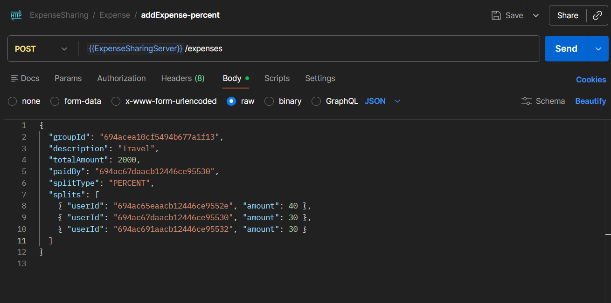
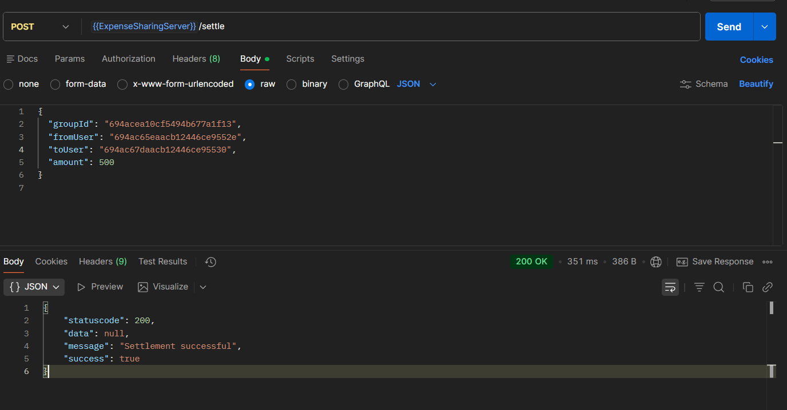
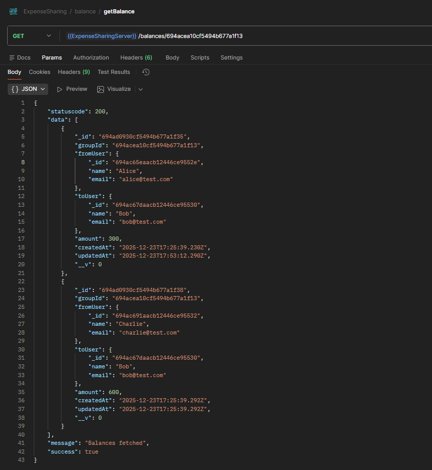

# Expense Sharing Application (Splitwise-like Backend)

## Overview

This project is a backend system for an expense sharing application similar to Splitwise.
It allows users to create groups, add shared expenses with multiple split strategies, track balances, and settle dues.

The focus of this project is business logic, data modeling, and balance simplification, not authentication or frontend UI.

## Features Implemented

Create users (minimal, no authentication)

Create groups with multiple members

Add shared expenses

Supported split types:

Equal split

Exact amount split

Percentage split

Automatic balance tracking

Balance simplification (netting dues)

Settle dues (partial & full settlements)

## Tech Stack

Node.js

Express.js

MongoDB

Mongoose

## System Design (High Level)

Core Entities

User

Represents a participant in expenses

Group

Collection of users sharing expenses

Expense

Records how an expense was split (equal / exact / percent)

Balance

Tracks who owes whom and how much (simplified)

## Important Design Decision

Expenses store intent

Percentages or exact values as entered by users

Balances store computed amounts

Actual money owed between users

This separation keeps the system flexible and correct.

## Balance Simplification Logic

When an expense is added:

For each participant who didn’t pay:

A balance entry is created (or updated)

If reverse balances exist:

They are netted out

Only the minimum number of balances remain

This ensures:

No circular debts

Clean and readable balances

## Settlement Logic

Users can settle dues partially or fully

Partial settlement reduces the balance

Full settlement removes the balance record

Over-settlement is prevented

## API Base URL
http://localhost:8000/expense-sharing/api/v1

## API Endpoints

### Users
Create User
POST /users

{
  "name": "Alice",
  "email": "alice@test.com"
}

{
  "name": "BOB",
  "email": "BOB@test.com"
}

{
  "name": "Charlie",
  "email": "Charlie@test.com"
}

### Groups
Create Group
POST /groups

{
  "name": "Goa Trip",
  "members": ["userId1", "userId2", "userId3"]
}

Get Group Details
GET /groups/:groupId

### Expenses
Add Expense
POST /expenses

Equal Split
{
  "groupId": "groupId",
  "description": "Hotel",
  "totalAmount": 3000,
  "paidBy": "userId1",
  "splitType": "EQUAL",
  "splits": [
    { "userId": "userId1", "amount": 1000 },
    { "userId": "userId2", "amount": 1000 },
    { "userId": "userId3", "amount": 1000 }
  ]
}

Exact Split
{
  "groupId": "groupId",
  "description": "Dinner",
  "totalAmount": 1200,
  "paidBy": "userId1",
  "splitType": "EXACT",
  "splits": [
    { "userId": "userId1", "amount": 300 },
    { "userId": "userId2", "amount": 400 },
    { "userId": "userId3", "amount": 500 }
  ]
}

Percentage Split
{
  "groupId": "groupId",
  "description": "Travel",
  "totalAmount": 2000,
  "paidBy": "userId2",
  "splitType": "PERCENT",
  "splits": [
    { "userId": "userId1", "amount": 40 },
    { "userId": "userId2", "amount": 30 },
    { "userId": "userId3", "amount": 30 }
  ]
}

### Balances
Get Balances for Group
GET /balances/:groupId

Example response:

[
  {
    "fromUser": "Alice",
    "toUser": "Bob",
    "amount": 800
  },
  {
    "fromUser": "Charlie",
    "toUser": "Bob",
    "amount": 600
  }
]

### Settle Dues
Settle Balance
POST /settle

{
  "groupId": "groupId",
  "fromUser": "userId1",
  "toUser": "userId2",
  "amount": 500
}

Partial settlement → reduces balance

Full settlement → removes balance entry

## How to Run Locally
git clone <repo-url>
cd Expense_Sharing_BS
npm install
npm run dev

**Ensure MongoDB is running and .env contains:**

PORT=8000
MONGO_URI=your_mongodb_connection_string
NODE_ENV=development

## Sample API Flow (Postman)

